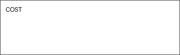

# Curso practico de Dinamica Molecular y Analisis de Trayectorias

Este repositorio contiene el material del curso en formato Carpentries, publicado con GitHub Pages en `docs/`.

## Organizacion

- **Fechas:** 15, 16 y 19 de enero de 2026
- **Lugar:** Universidad Andres Bello, Concepcion, Chile
- **Modalidad:** Presencial, practico (manana y tarde)
- **Idioma:** Espanol
- **Profesor:** [Jordi Villa i Freixa](mailto:jordi.villa@uvic.cat), [Computational Biochemistry and Biophysics Lab](https://mon.uvic.cat/cbbl), [Universitat de Vic - Universitat Central de Catalunya](https://www.uvic.cat), [IRIS-CC](https://iris-cc.cat)
- **Cupo limitado:** 15-20 participantes
- **Inscripcion previa obligatoria**
- **Contacto:** Veronica Andrea Jimenez Curihual [veronica.jimenez@unab.cl](mailto:veronica.jimenez@unab.cl)

## Requisitos previos

- Conocimientos basicos de bioinformatica o quimica computacional
- Familiaridad con la linea de comandos de Linux
- Conocimientos basicos de Python
- Acceso a un cluster o workstation con GPU, idealmente con OpenMM

## Programa del curso

### Dia 1: Jueves 15 de enero
**Tema central:** Fundamentos de simulaciones clasicas con OpenMM

**Manana (09:00 - 13:00):**
- Bienvenida y presentacion del curso
- Teoria minima de dinamica molecular
- Preparacion de sistemas en OpenMM (topologia, fuerza, solvente)
- Parametrizacion con OpenMM y OpenFF
- Ejecucion de simulaciones cortas en GPU

**Tarde (14:30 - 18:00):**
- Analisis basico de trayectorias con MDAnalysis
- Ejercicios: RMSD, RMSF, radio de giro, distancias internas
- Buenas practicas de control de calidad

### Dia 2: Viernes 16 de enero
**Tema central:** Tecnicas avanzadas y modelos de Markov

**Manana (09:00 - 13:00):**
- Tecnicas avanzadas en OpenMM:
  - **Steered MD (SMD)**
  - **Umbrella Sampling**
  - **Metadynamics**
- Configuracion y ejecucion de protocolos avanzados
- Consideraciones de eficiencia y escalabilidad

**Tarde (14:30 - 18:00):**
- Modelos de Markov con PyEMMA
  - Introduccion a MSM
  - Extraccion de features con MDAnalysis + PyEMMA
  - Clustering y construccion del modelo
  - Tiempos de relajacion y estados metaestables
- Caso aplicado: transiciones conformacionales en una proteina

### Dia 3: Lunes 19 de enero (solo manana)
**Tema central:** Proyectos individuales y consultoria

**Manana (09:30 - 13:00):**
- Discusion de proyectos de los participantes
- Consultoria tecnica personalizada
- Recomendaciones de buenas practicas en simulaciones y analisis

## Colaboradores

Con la colaboracion de  Pan-European Network on Computational Redesign of Enzymes.

Con el soporte de Fondecyt Fondo Nacional de Desarrollo Cientifico y Tecnologico

